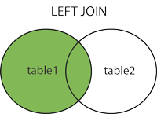

## Objective
Learn to join tables.

## Lab

### Setup
* Connect to a database
   ```
   > sqlite3 lab4.db
   ```

A data set for the collection of cards for [Hearthstone](https://playhearthstone.com/en-us/),
the popular online card game by Blizzard. This data set is freely available from 
[Kaggle](https://www.kaggle.com/jeradrose/hearthstone-cards).

### JOINs

A JOIN clause is used to combine rows from two or more tables, based on a related column between them.

The query below will select the card name and "dust cost" (how much "dust" it costs to craft the card) for each card in basic_cards.
It does this by matching each row in basic_cards with each row in dust_costs based on the card_id of each.

```sql
SELECT name, dust_costs.cost AS dust_cost
  FROM basic_cards 
 INNER JOIN dust_costs on basic_cards.card_id = dust_costs.card_id
 WHERE dust_costs.action = 'CRAFTING_NORMAL';
```

Hint: Note that in the SELECT clause, we use an alias (_AS dust_cost_) for columns dust_costs.cost. This allows us to rename the column
which improves the format of the resulting query. It also makes it easier to address the column in our Java (or other) code.

This type of join is called an **INNER JOIN** or, more commonly, just **JOIN**. It returns records that have matching  values in both tables.
Inner joins are most commonly used, but there are other types of joins that are also used.

The types of joins are:
* **(INNER) JOIN**: Returns records that have matching values in both tables


* **LEFT (OUTER) JOIN**: Return all records from the left table, and the matched records from the right table



* **RIGHT (OUTER) JOIN**: Return all records from the right table, and the matched records from the left table


* **FULL (OUTER) JOIN**: Return all records when there is a match in either left or right table


#### INNER JOINS

The INNER JOIN keyword selects records that have matching values in both tables.

The syntax is:

```sql
SELECT column_name(s)
  FROM table1
 INNER JOIN table2 ON table1.column_name = table2.column_name;
```

You can also join multiple tables. The query below joins basic_cards, dust_costs and mechanics to select
the name, dust_cost and mechanic for each card.

```
SELECT name, dust_costs.cost AS dust_cost, mechanics.mechanic
  FROM ((basic_cards
 INNER JOIN dust_costs ON basic_cards.card_id = dust_costs.card_id)
 INNER JOIN mechanics ON mechanics.card_id = basic_cards.card_id);
```

#### LEFT JOIN

The LEFT JOIN keyword returns all records from the left table (table1), 
and the matched records from the right table (table2). 
The result is NULL from the right side, if there is no match.

The syntax is:

```sql
SELECT column_name(s)
FROM table1
LEFT JOIN table2 ON table1.column_name = table2.column_name;
```

The query below left joins dust_costs with basic_cards.

```sql
SELECT dust_costs.cost AS dust_cost, name
  FROM dust_costs
  LEFT JOIN basic_cards on dust_costs.card_id = basic_cards.card_id;
```

**Note**: The LEFT JOIN keyword returns all records from the left table (dust_costs), even if there are no matches in the right table (basic_cards). The NULL output appears as blank in SQLite.

#### RIGHT JOIN

The RIGHT JOIN is equivalent to LEFT JOIN except that it returns all records from the right table (table2), and the matched records from the left table (table1). The result is NULL from the left side, when there is no match.

#### FULL OUTER JOIN

The FULL OUTER JOIN keyword returns all records when there is a match in either left (table1) or right (table2) table records.

The query below outer joins dust_costs with basic_cards. So every record from each table will be returned.
If a record exists in dust_costs having a card_id with no match in basic_cards, then the name column will be NULL.
If a record exists in basic_cards having a card_id with no match in dust_cards, then the dust_cost column will be NULL.

**Note**: LEFT OUTER JOIN is implemented, but RIGHT OUTER JOIN or FULL OUTER JOIN is NOT implemented in SQLite.

### Finding missing rows

Outer joins can be helpful in many circumstances. One problem they are 
especially suited for is in finding missing rows. 
The query below will find all rows in dust_cost where there is no corresponding row in basic_cards.

```sql
SELECT dust_costs.*
  FROM dust_costs
  LEFT JOIN basic_cards on dust_costs.card_id = basic_cards.card_id
 WHERE basic_cards.card_id IS NULL;
```

### Your turn
Now it's your turn to apply what you've learned. See `Homework 3` in the Canvas.
